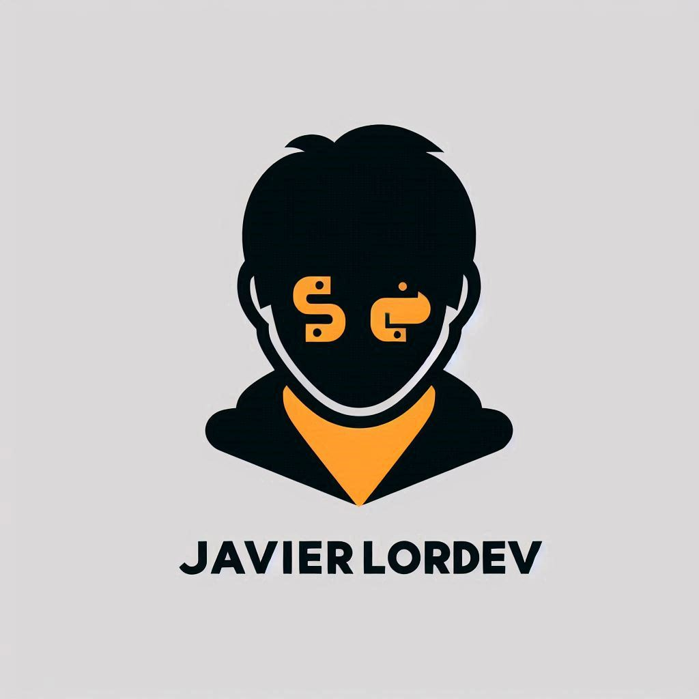

<h1 align="center">¡Hola, Soy JavierLorDev!</h1>

 

¡Bienvenido a mi perfil de GitHub! Soy un desarrollador junior en Python intentando formarme cada dia.

## Sobre mí

***Soy un desarrollador entusiasta con un gran interés en la tecnología y la programación. Me encanta trabajar en nuevos proyectos y aprender nuevas cosas cada día.***
 

## 🛠 &nbsp;TECNOLOGIAS

&nbsp;
&nbsp;
&nbsp;
&nbsp;
&nbsp;
&nbsp;

 

  
  

## Proyectos 

En Proceso......
......
......

## Contáctame

¡No dudes en ponerte en contacto conmigo! Puedes encontrarme en:

# https://github.com/Flychesco.      
# Javierlordev@gmail.com 

- [Sitio web personal](https://github.com/Flychesco)

¡Espero poder colaborar contigo en el futuro! [Contactame]

[Contactame]:https://github.com/Flychesco

